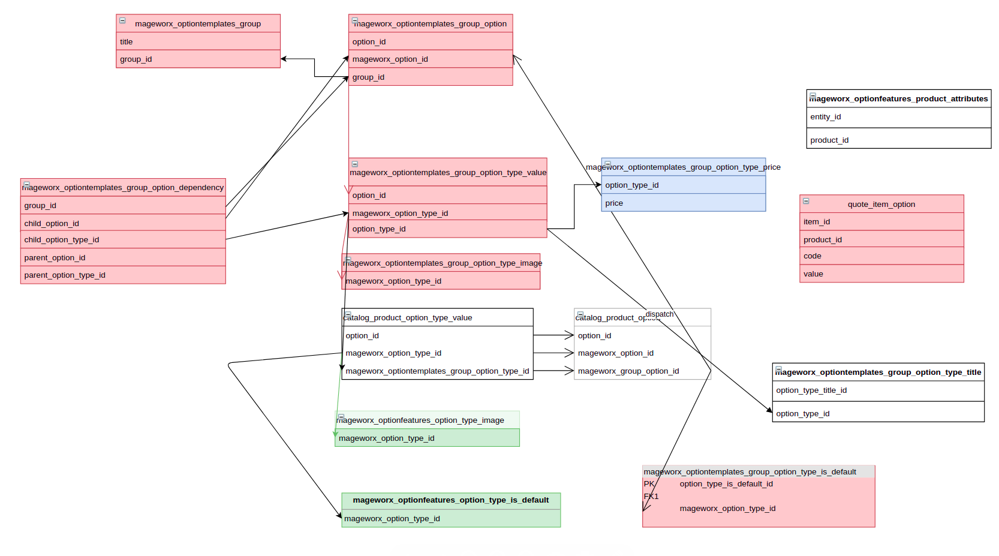

AMPQ message queue to apply MageWorx templates to products
---

http://localhost:15672/#/  
Login: `user`  
Password: `bitname`  
---

Useful commands:

 * run queue worker: `bin/magento queue:consumers:start option_templates.save --batch-size=100`

 * docker exec -ti skanva-rabbitmq bash

 * `root@skanva-rabbitmq:/#` rabbitmqadmin list queues -u vinduesgrossisten -p pass4vinduesgrossisten
```
+-----------------------+----------+
|         name          | messages |
+-----------------------+----------+
| async.operations.all  | 0        |
| option_templates.save | 0        |
+-----------------------+----------+
```
* bin/magento belvg:mageworx:templates-force-apply {storeIds, comma separated} {productIds, comma separated} {templateIds, comma separated}  
For example, if we need to re-apply MWOT ID=5 for DK store: `bin/magento belvg:mageworx:templates-force-apply 1 - 5` 
```
1. cleans up all mageworx option groups for products from {productIds} param, if param is null all products are used, set - to skip this param
2. Re applies options and option values for {temlateIds} and {productIds} if some param is null all items are used
```

```
CLI command to update mwot option templates. Upload file to retrieve data from: Stores->Configuration->BELVG->MageWorx Option Templates Update->Import File
Set store Id by --store-id=5
```
* bin/magento belvg:mageworx_option_templates:update --store-id=5


* to check inconsistency between MWOT and Product Options`bin/magento belvg:mageworx:health_check --prod-id=4065`

Color option can have such variants: without, inside, outside, both
* Examples:
- belvg:mageworx:health_check --colors=without
  or
- belvg:mageworx:health_check -c=without

Useful SQLs:
* 
```mysql
SELECT prod_option.product_id, prod_option.mageworx_group_option_id, prod_option.inside_outside_color, prod_option.warning_msg,
    mwot_group_option.group_id, mwot_group.title as mwot_group_title,
    prod_option_title.title, prod_option_title.store_id,
    prod_option_type_value.mageworx_optiontemplates_group_option_type_id, prod_option_type_value.mageworx_option_type_id, prod_option_type_value.group_option_value_id,
    prod_option_type_title.store_id, prod_option_type_title.title prod_value_title
FROM `catalog_product_option` prod_option
JOIN `mageworx_optiontemplates_group_option` mwot_group_option ON (prod_option.mageworx_group_option_id = mwot_group_option.mageworx_option_id)
JOIN `mageworx_optiontemplates_group` mwot_group ON (mwot_group_option.group_id = mwot_group.group_id)
JOIN `catalog_product_option_title` prod_option_title ON (prod_option.option_id = prod_option_title.option_id)
JOIN `catalog_product_option_type_value` prod_option_type_value ON (prod_option.option_id = prod_option_type_value.option_id)
JOIN `catalog_product_option_type_title` prod_option_type_title ON (prod_option_type_value.option_type_id = prod_option_type_title.option_type_id)
WHERE prod_option.product_id = 4065
```

* 
```mysql
SELECT mwot_relation.product_id,
    mwot_group.group_id, mwot_group.title as mwot_group_title,
    mwot_option.option_id, mwot_option.mageworx_option_id, mwot_option.inside_outside_color, mwot_option.warning_msg,
    mwot_option_title.*,
    mwot_option_value_title.store_id, mwot_option_value_title.title as option_value_title
FROM `mageworx_optiontemplates_relation` mwot_relation
JOIN `mageworx_optiontemplates_group` mwot_group ON (mwot_relation.group_id = mwot_group.group_id)
JOIN `mageworx_optiontemplates_group_option` mwot_option ON (mwot_group.group_id = mwot_option.group_id)
JOIN `mageworx_optiontemplates_group_option_title` mwot_option_title ON (mwot_option.option_id = mwot_option_title.option_id)
JOIN `mageworx_optiontemplates_group_option_type_value` mwot_option_value ON (mwot_option.option_id = mwot_option_value.option_id)
JOIN `mageworx_optiontemplates_group_option_type_title` mwot_option_value_title ON (mwot_option_value.`option_type_id` = mwot_option_value_title.`option_type_id`)
where product_id = 4065
order by mwot_group.group_id ASC
```

* Database schema:   
https://drive.google.com/file/d/1z1r4nXQuG3p5Sfz6o9aMVODjP_XazOyU/view?usp=sharing

* Retrieve mwot templates options data to translate
```mysql
SELECT 
    mog.group_id AS `group_id`,
    mog.title AS `group_title`,
    mogo.type AS `option_type`,
    mogo.option_id AS `option_id`,
    mogo.mageworx_option_id AS `mageworx_option_id`,
    mogotv.option_type_id AS `option_type_id`,
    mogot.title AS `option_title`,
    mogod.description AS `option_description`,
    mogow.warning AS `option_warning`,
    mogott.title AS `value_title`
FROM
    mageworx_optiontemplates_group AS mog
        LEFT JOIN
    mageworx_optiontemplates_group_option AS mogo ON mog.group_id = mogo.group_id
        LEFT JOIN
    mageworx_optiontemplates_group_option_title AS mogot ON mogo.option_id = mogot.option_id
        AND mogot.store_id = 1
        LEFT JOIN
    mageworx_optiontemplates_group_option_description AS mogod ON mogo.mageworx_option_id = mogod.mageworx_option_id
        AND mogod.store_id = 1
        LEFT JOIN
    mageworx_optiontemplates_group_option_warning AS mogow ON mogo.mageworx_option_id = mogow.mageworx_option_id
        AND mogow.store_id = 1
        LEFT JOIN
        mageworx_optiontemplates_group_option_type_value AS mogotv ON mogo.option_id = mogotv.option_id
        LEFT JOIN 
        mageworx_optiontemplates_group_option_type_title AS mogott ON mogotv.option_type_id = mogott.option_type_id AND mogott.store_id=1
LIMIT 1000
```
